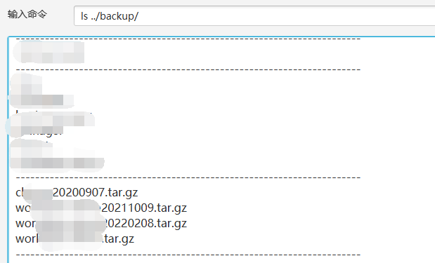
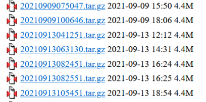
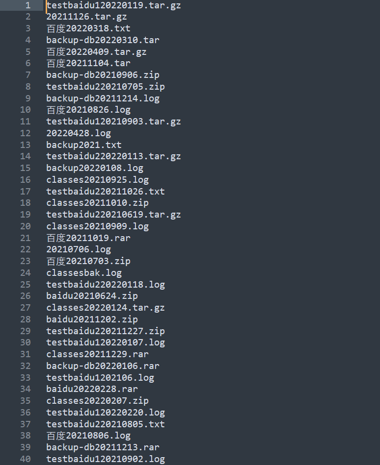

# GenDirDict

 GenDirDict —— 一款用于生成目录暴破字典的工具

主要用于生成备份文件字典，此外，也会提取部分域名关键词加入目录扫描字典

## 0x00 Introduce

在日常测试或挖src过程中偶尔会遇到一些网站存在打包的源码或其他文件，但dirsearch扫不到的情况

网站目录与时间组合：



纯时间，年月日时分秒：



还有域名中关键词与时间组合等多种情况，于是写了这个工具用于生成一些结合目标站点信息的目录暴破字典

默认后缀：

```
tar.gz, zip, rar, tar, txt, log
```

扩展后缀：

```
7z,bak,bz2,gz,log,mdb,rar,sql,tar,tar.bz2,tar.gz,txt,zip,old,tar.gzip
```

> 后续计划通过参数自定义后缀

时间形式：

> 默认启用前3种格式，4，5可以通过提高level级别启用，第6种理论上可用，不具有实际意义(数据量太大)

```
%Y
%Y%m
%Y%m%d
%Y-%m
%Y-%m-%d
%Y%m%d%H%M%S
```

组合方式：

```
时间 + 后缀					   eg: 20220202.tar.gz
域名 + 后缀 		  		   eg: www.baidu.com.tar.gz
域名关键词 + 后缀 	  			 eg: baidu.tar.gz
域名关键词 + 时间 + 后缀 	  	eg: baidu.tar.gz
目标关键词 + 后缀				 eg: 百度.rar
目标关键词 + 时间 + 后缀 		eg: 百度20220202.rar
站点目录关键词 + 后缀			eg: backup.tar.gz
站点目录关键词 + 时间 + 后缀 	   eg: backup20220202.tar.gz
```

## 0x01 Usage

```shell
git clone https://github.com/chaserw/GenDirDict.git
cd GenDirDict
chmod +x gen_dir_dict.py
python3 gen_dir_dict.py
usage: gen_dir_dict.py [-h] (-d DOMAIN | -u URL | -f FILE) [-k KEYWORDS]
                       [-p PATH] [-y {1,2,3,4,5}]
                       [--dirsearch-path DIRSEARCH_PATH]
                       [--exclude-url-path-words EXCLUDE_URL_PATH_WORDS]
                       [-o OUTPUT] [-l {1,2,3,4,5}]
```

## 0x02 Overview

### 查看帮助

```shell
python3 gen_dir_dict.py -h
```

```
usage: gen_dir_dict.py [-h] (-d DOMAIN | -u URL | -f FILE) [-k KEYWORDS]
                       [-p PATH] [-y {1,2,3,4,5}]
                       [--dirsearch-path DIRSEARCH_PATH]
                       [--exclude-url-path-words EXCLUDE_URL_PATH_WORDS]
                       [-o OUTPUT] [-l {1,2,3,4,5}]

Generate dictionary of brute force directory

optional arguments:
  -h, --help            show this help message and exit
  -d DOMAIN, --domain DOMAIN
                        Single domain. eg: www.baidu.com or baidu.com
  -u URL, --url URL     Single url. eg: https://www.baidu.com/baidu.php?id=1
  -f FILE, --file FILE  Domain or url file, one domain or url per line.
  -k KEYWORDS, --keywords KEYWORDS
                        Keywords of target site, separated by commas. eg: baidu,百度
  -p PATH, --path PATH  Known path of target site. eg: sysadmin
  -y {1,2,3,4,5}, --year {1,2,3,4,5}
                        Latest year range of time dictionary. Default year is 2.
  --dirsearch-path DIRSEARCH_PATH
                        Path of dirsearch. eg: c:\users\administrator\dirsearch
  --exclude-url-path-words EXCLUDE_URL_PATH_WORDS
                        Exclude Words in url path, separated by commas. eg: static
  -o OUTPUT, --output OUTPUT
                        Filename of dictionary to be generated. eg: baidu.com.txt. Default filename is dir.txt.
  -l {1,2,3,4,5}, --level {1,2,3,4,5}
                        Choose level of dictionory complexity.
                        Level 1: Only generate directory dictionary without keywords, path and time.
                        Level 2: Generate directory dictionary without time.
                        Level 3: Generate directory dictionary with domain, keywords, path and time. eg: baidu20220202.zip
                        Level 4: Generate directory dictionary with domain, keywords, path and time.
                        This level add more combination of domain, keywords, path and time. eg: baidu-20220202.zip
                        This level add more extension filename to combine. ext: 7z,bak,bz2,gz,log,mdb,rar,sql,tar,tar.bz2,tar.gz,txt,zip,old,tar.gzip
                        Level 5: Generate directory dictionary with domain, keywords, path and time.
                        This level adds hour, minute, second and year, month, and day combinations. eg: 20220202020202.zip
                        Default level is 3, which is supposed to use. Level 5 is not recommended, because the amount of data is very large and it takes a long time to brute.
```

### 参数说明

- -h/--help	                             	查看帮助

- -d/--domain                               指定域名

- -u/--url                                        指定url

- -f/--file                                         从文件中读取域名和url，每行一个，待实现

- -k/--keywords                             指定目标关键词

- -p/--path                                      指定已知的站点目录

- -y/--year                                       指定时间字典年限，可选1-5，默认近两年

- --dirsearch-path                         指定dirsearch路径，用于拼接dirsearch字典，待实现

- --exclude-url-path-words          排除url中的特定目录关键词，不用于组合生成字典，如：static，待实现

- -o/--output                                   指定保存字典文件名，默认为dir.txt

- -l/--level                                         指定级别，可选1-5，默认为3

  ​                                                        Level 1：只使用域名生成字典

  ​													    Level 2：使用域名、关键词和站点目录生成字典，不使用时间

  ​                                                        Level 3：使用域名、关键词、站点目录和时间及其组合生成字典，默认启用

  ​                                                        Level 4：添加组合格式如：baidu-20220202.zip，并启用扩展后缀进行组合

  ​                                                        Level 5：时间字典启用年月日时分秒格式，不建议使用，数据量巨大

  ​																		 如果你用超算暴目录，当我没说

> level的设计还有待优化，而且目前还没有完整实现
>
> level 1和level 2没有进入判断逻辑，level 4应该勉强能用，level 5因为年月日时分秒组合起来数据量太大，所以限定了level 5只生成近3个月的时间组合，毕竟一天就是86400，3个月组合起来依然很大，推荐用level 3
>
> 下一步优化方向是可以使用level设定级别，也可以通过参数自定义组合搭配

### 使用演示

```shell
python3 .\gen_dir_dict.py -d www.baidu.com -k "百度,baidu" -p "testbaidu1,testbaidu2" -y 1 -l 3 -o www.baidu.com.txt
```

> 目前没有加入命令行打印内容，后续计划会加入一些提示和log信息打印

生成文件默认在当前目录，默认文件名为dir.txt



## 0x03 TODO

- [ ] 从文件读取多个url和域名
- [ ] 自定义后缀列表
- [ ] 自动合并dirsearch目录
- [ ] 输入关键词是字母的首字母自动大写，大小写组合字典
- [ ] 日志打印
- [ ] 指定参数是否启用扩展后缀名字典
- [x] domain, url和file互斥输入实现
- [ ] 输入检查

